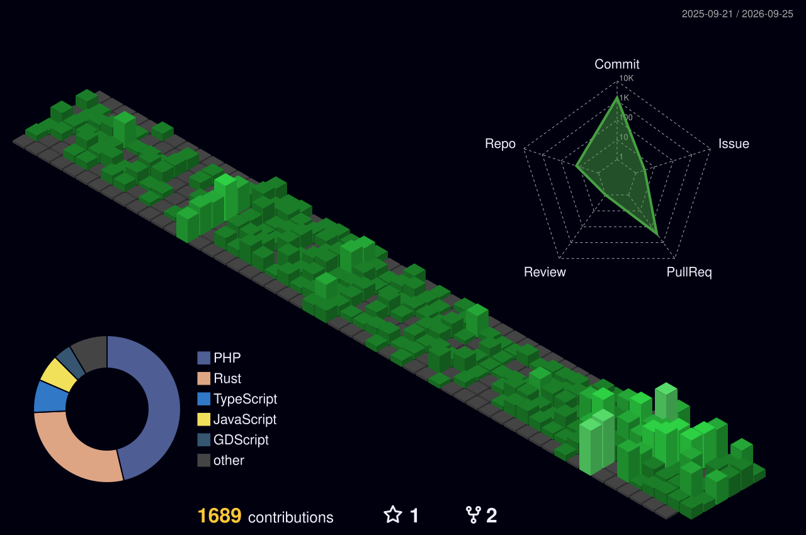

# ¡Hola! Soy Rafa 👋
### Backend & Laravel Engineer | Arquitectura Limpia

## 📖 Sobre Mí
Especializado en el ecosistema **PHP / Laravel**. Diseño APIs RESTful robustas, automatizo procesos y construyo bases sólidas para aplicaciones escalables. Tengo tolerancia cero al desorden: creo firmemente en el código limpio, la documentación y el testing automatizado (TDD).

* 💼 **Experiencia actual:** Desarrollador de Software en Softtalia construyendo la plataforma SaaS **RapidGest**.
* 🎯 **Enfoque principal:** Lógica de negocio compleja, optimización de consultas SQL y cultura TDD con PestPHP.
* 🛠️ **Infraestructura:** Experiencia en despliegues con Docker/Sail, CI/CD, gestión de AWS S3 y Webhooks.
* 🌍 **Idiomas:** Español, Catalán e Inglés.

## 🚀 Tecnologías y Herramientas

### Stack Principal (TALL & Backend)

  

 

## 📊 Actividad en GitHub y Estadísticas

  

## 💼 Proyectos Destacados

* 🏢 **[RapidGest SaaS](#)** - Plataforma integral de gestión empresarial. Desarrollo de APIs RESTful robustas, autenticación multi-proveedor (Jetstream) y gestión documental Cloud (AWS S3). *(Laravel 11, Livewire 3, Redis, Docker)*
* ⚙️ **[API Core Architecture](#)** - Base arquitectónica para microservicios escalables. Implementación de patrones de diseño Clean Code, recursos API optimizados y documentación con Swagger/OpenAPI. *(PHP 8.2, MySQL, Sanctum)*
* ✅ **[Mini Task Manager](#)** - Gestor de tareas SPA robusto y reactivo. Gestión de estados en tiempo real sin recargas de página y exportación a PDF. *(Laravel 12, Livewire 3, Alpine.js, Tailwind, PestPHP)*

## 🧪 Laboratorio Experimental

Un espacio donde rompo cosas para aprender. Bots, scripts de IA, automatizaciones y prototipos rápidos:

* 📍 **Maps Scraper & IG Lead Extractor:** Scripts de automatización en Python para recolección de leads B2B y extracción de datos.
* 🤖 **Bots de Discord Integrados:**
  * *Git-Discord Sync:* Webhooks CI/CD para notificar PRs e issues.
  * *Jira Agile Bot:* Puente entre gestión de proyectos y comunicación.
  * *FlexBot Mod:* Bot de moderación de servidores y logs de auditoría.
* 🧠 **Inteligencia Artificial:** Red neuronal clásica (MNIST) y script generador de imágenes con Stable Diffusion.

---

## 🌐 Conecta conmigo

> *"Aunque mi día a día está en el backend, mi verdadera motivación es aprender cómo funciona la máquina por debajo."*
